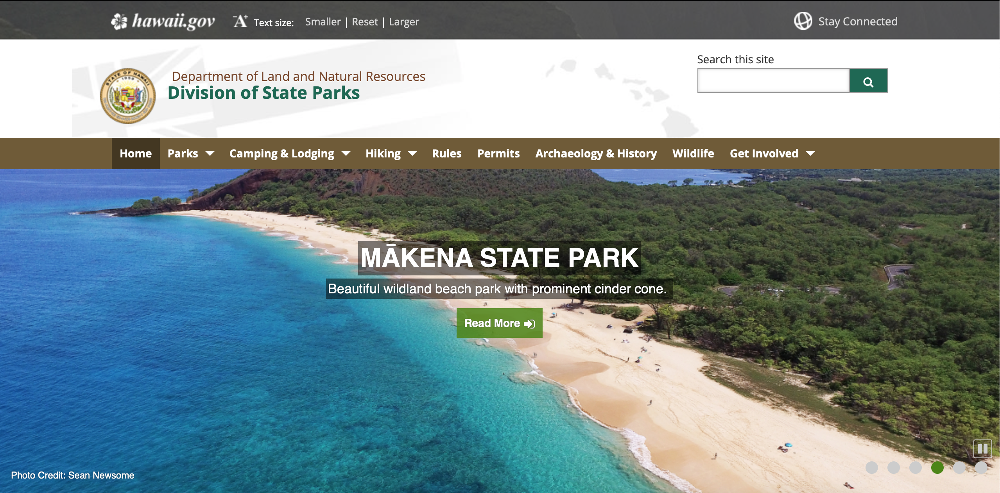
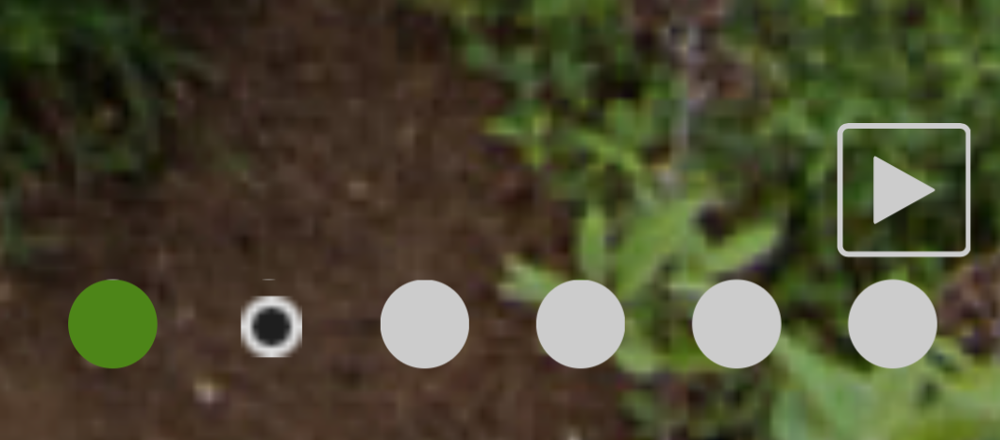
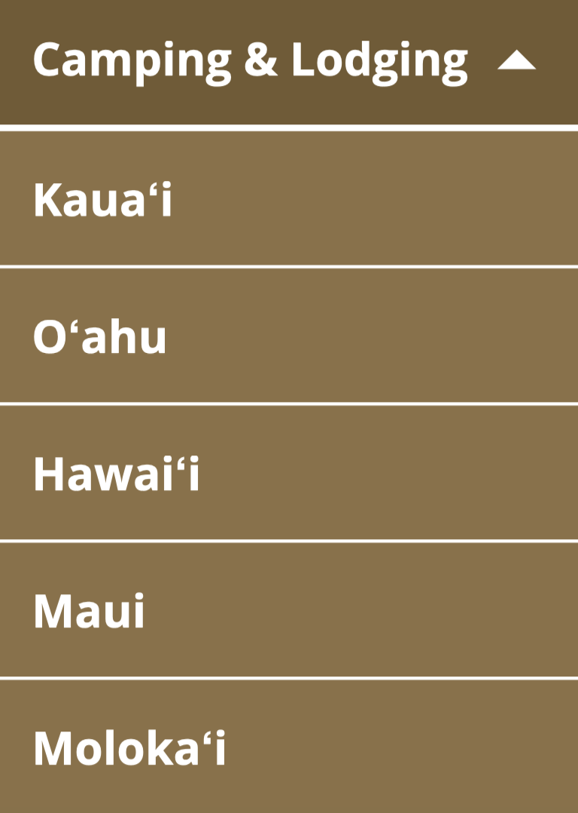
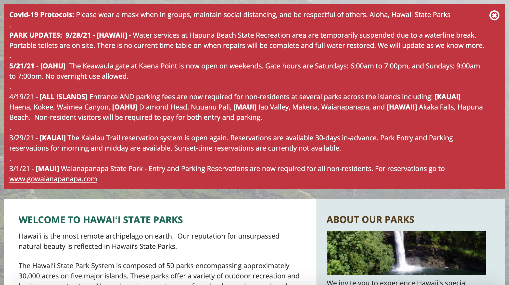
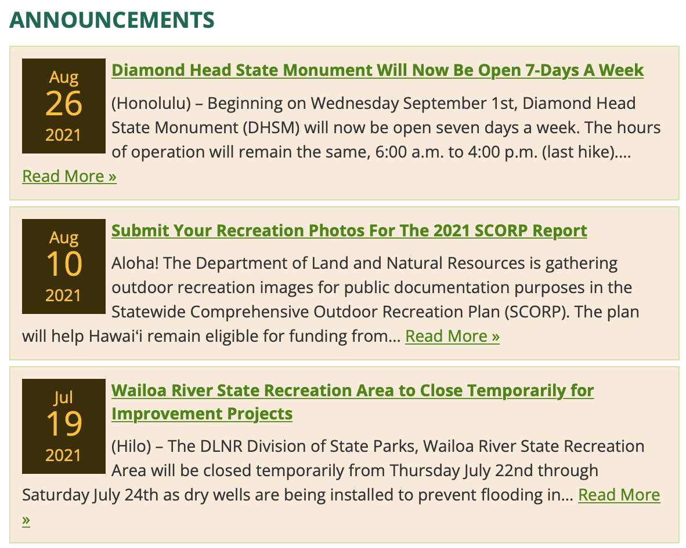

# Activities Finder for Residents and Visitors of Hawaii

## Assignment 01: Heuristic Evaluation of Hawaii's Government Websites
Vivian Wong, Digital Humanities 110

### Project Description
As I was researching Hawaii's different government websites, I noticed that there were many different platforms for residents and visitors to search from. These websites were created with the intent of informing people about activities they can do around Hawaii. As a big fan of traveling, I've always enjoyed visiting beautiful nature spots, like national parks, which are managed by the government. 

For my government-based UX project, I want to create a visitors and residents' guide that consolidates all of the information for visiting government managed locations -- such as national parks, nature spots (i.e. hiking trails, beaches, etc.) as well as local events and businesses to support. This project was inspired by one of [Hawaii's Department of Land and Natural Resources'](https://dlnr.hawaii.gov/dsp/) websites, as well as one of [Hawaii's Department of Business, Economic Development and Tourism's](https://invest.hawaii.gov/buy-hawaii/) websites, which I am conducting heuristic evaluations on. While there were different government websites that provided this information,  I believe it would be useful for all of this information to be found in one place.

## Overview of Severity Ratings
Referencing the Nielsen Norman Group's Severity Ratings for Usability Problems, I will rank each heuristic from a scale of 1-3, which goes as follows:
|Rating|Description|
|---|---|
|1|Cosmetic problem only: need not be fixed unless extra time is available on project|
|2|Minor usability problem: fixing this should be given low priority|
|3|Major usability problem: important to fix, so should be given high priority|
###### Source: [Severity Ratings for Usability Problems](https://www.nngroup.com/articles/how-to-rate-the-severity-of-usability-problems/)

## Website 1: Department of Land and Natural Resources -- Division of State Parks

The first website I am analyzing is by the Department of Land and Natural Resources. This website focuses on giving users information regarding recreational activities in nature. It provides information about state parks, camping & lodging, hiking, the history of Hawaii, and local wildlife. 

Website Link: https://dlnr.hawaii.gov/dsp/

## Initial Evaluation: DONT FORGET THIS PART

|Heuristics + Descriptions|Reference Image|Comments|Recommendations|Rating|
|---|---|---|---|---|
|**1. Visibility of System Status:** Provide the user with information about what is happening with their interactions on the website.| |The website has features which shows how the user can interact with the website, as well as what is currently going on within the website. For example, the home page features a slideshow, which shows the user which picture it is currently on (with the green dot), how many pictures are left in the slideshow, and an indicator on the picture they are hovering over.|For this slideshow feature, I would recommend the website provide an indicator that also showcases how much time was allocated for each picture on the slideshow when it is playing. This way, the user would know when to expect the next image to pop up.|1|
|**2. Match Between the System and Real World:** Create designs and interactions that are relevant to us and mimics what we already know from reality. |   | The drop down menu changes the direction of its arrow as the menu is expanded and closed. The different arrows allow users to understand what will happen when they click on the menu, especially since people use arrows in real life to indicate direction. | To improve the user experience of the drop down menu, I would recommend that the menu automatically expands when users hover over the tab. Currently, users have to click on the tab in order to expand the information in the menu, which takes an extra click for users to activate the result.| 2 |
|**3. User Control and Freedom:** The design gives users the freedom to fix any mistakes made while navigating the website (options for undos and redos)| |The website currently provides users with information regarding COVID-19 in the red box, which users have the freedom to exit out of. However, once the user clicks the exit button for this box, they are unable to reaccess this information unless the page is reloaded.|Since this information is important for current users to be aware of, the box should be created in a expandable format rather than one where the information disappears after exiting, similar to how the drop down menus of the website are able to expand and contract when clicked. This way, once users finish reading the information and wish to exit, they are able to make the contents of the box smaller, while being able to re-access the information whenever they want.| 3 |
|**4. Consistency and Standards:** Staying consistent within the design by utilizing the same design features for the same interactions. This includes using design features that are common within other designs and platforms as well.|  | 
