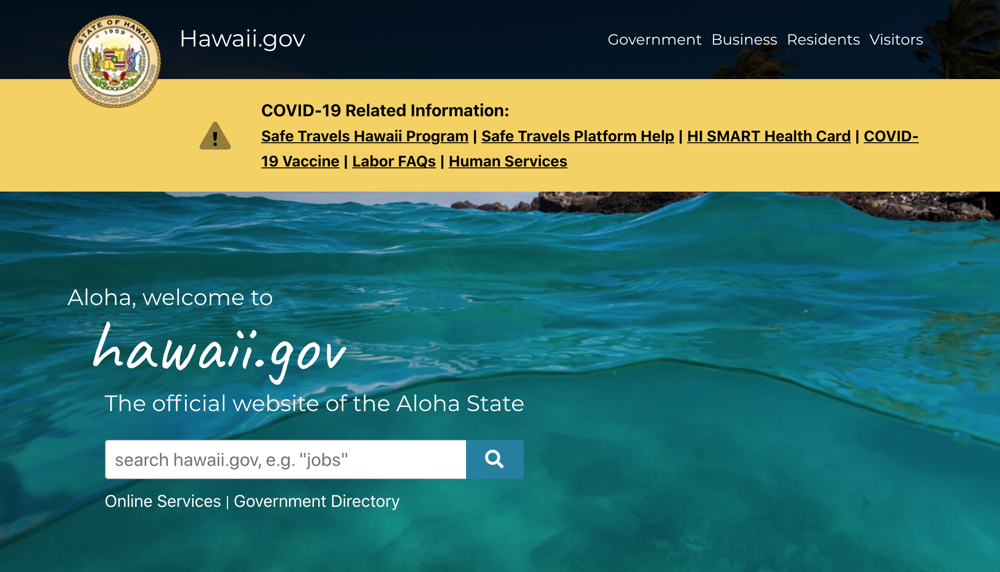

# Activities Finder for Residents and Visitors of Hawaii

## Assignment 01: Heuristic Evaluation of Hawaii's Government Websites
Vivian Wong, Digital Humanities 110

### Project Description
As I was researching Hawaii's different government websites, I noticed that there were many different platforms for residents and visitors to search from. These websites were created with the intent of informing people about activities they can do around Hawaii. As a big fan of traveling, I've always enjoyed visiting beautiful nature spots, like national parks, which are managed by the government. 

For my government-based UX project, I want to create a visitors and residents' guide that consolidates all of the information for visiting government managed locations -- such as national parks, nature spots (i.e. hiking trails, beaches, etc.) as well as local events and businesses to support. This project was inspired by one of [Hawaii's Department of Land and Natural Resources'](https://dlnr.hawaii.gov/dsp/) websites, as well as one of [Hawaii's Department of Business, Economic Development and Tourism's](https://invest.hawaii.gov/buy-hawaii/) websites, which I am conducting heuristic evaluations on. While there were different government websites that provided this information,  I believe it would be useful for all of this information to be found in one place.

## Website 1: Department of Land and Natural Resources

https://portal.ehawaii.gov/

