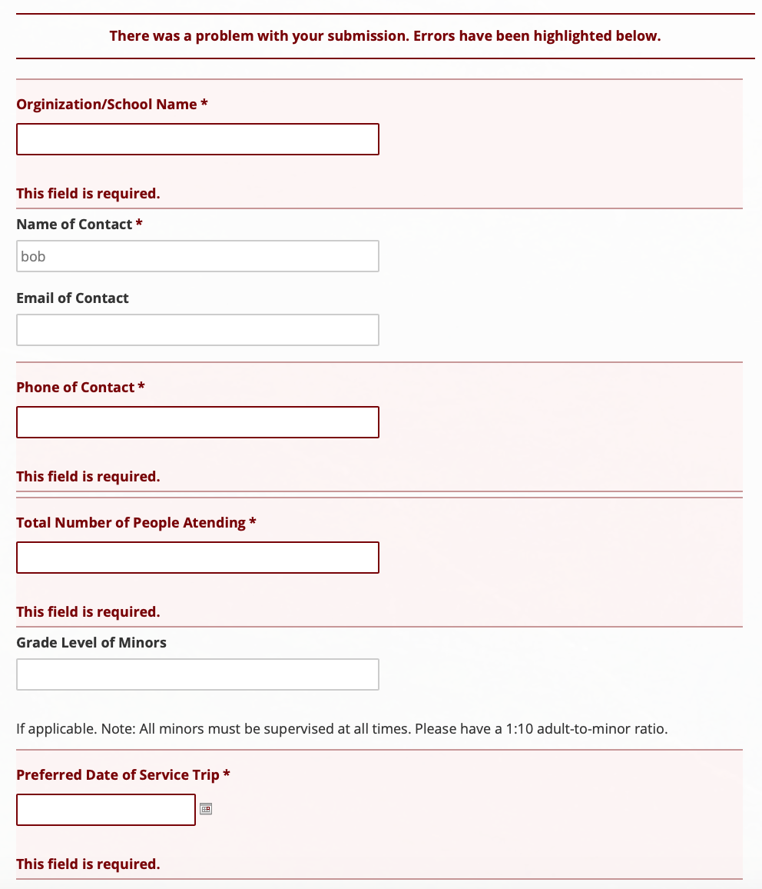

# Activities Finder for Residents and Visitors of Hawaii

## Assignment 01: Heuristic Evaluation of Hawaii's Government Websites
Vivian Wong, Digital Humanities 110

### Project Description
As I was researching Hawaii's different government websites, I noticed that there were many different platforms for residents and visitors to search from. These websites were created with the intent of informing people about activities they can do around Hawaii. As a big fan of traveling, I've always enjoyed visiting beautiful nature spots, like national parks, which are managed by the government. 

For my government-based UX project, I want to create a visitors and residents' guide that consolidates all of the information for visiting government managed locations -- such as national parks, nature spots (i.e. hiking trails, beaches, etc.) as well as local events and businesses to support. This project was inspired by one of [Hawaii's Department of Land and Natural Resources'](https://dlnr.hawaii.gov/dsp/) websites, as well as one of [Hawaii's Department of Business, Economic Development and Tourism's](https://invest.hawaii.gov/buy-hawaii/) websites, which I am conducting heuristic evaluations on. While there were different government websites that provided this information,  I believe it would be useful for all of this information to be found in one place.

## Overview of Severity Ratings
Referencing the Nielsen Norman Group's Severity Ratings for Usability Problems, I will rank each heuristic from a scale of 1-3, which goes as follows:
|Rating|Description|
|---|---|
|1|Cosmetic problem only: need not be fixed unless extra time is available on project|
|2|Minor usability problem: fixing this should be given low priority|
|3|Major usability problem: important to fix, so should be given high priority|
###### Source: [Severity Ratings for Usability Problems](https://www.nngroup.com/articles/how-to-rate-the-severity-of-usability-problems/)

## Website 1: Department of Land and Natural Resources -- Division of State Parks

The first website I am analyzing is by the Department of Land and Natural Resources. This website focuses on giving users information regarding recreational activities in nature. It provides information about state parks, camping & lodging, hiking, the history of Hawaii, and local wildlife. 

Website Link: https://dlnr.hawaii.gov/dsp/

### Initial Evaluation
My initial impression of this website was that it is well designed with lots of relevant content. I felt as though it was easy to navigate through the information in the menu and easily locate the most important information on the home page.

|Heuristics + Descriptions|Reference Image|Comments|Recommendations|Rating|
|---|---|---|---|---|
|**1. Visibility of System Status:** Provide the user with information about what is happening with their interactions on the website.| |The website has features which shows how the user can interact with the website, as well as what is currently going on within the website. For example, the home page features a slideshow, which shows the user which picture it is currently on (with the green dot), how many pictures are left in the slideshow, and an indicator on the picture they are hovering over.|For this slideshow feature, I would recommend the website provide an indicator that also showcases how much time was allocated for each picture on the slideshow when it is playing. This way, the user would know when to expect the next image to pop up.|1|
|**2. Match Between the System and Real World:** Create designs and interactions that are relevant to us and mimics what we already know from reality. |   | The drop down menu changes the direction of its arrow as the menu is expanded and closed. The different arrows allow users to understand what will happen when they click on the menu, especially since people use arrows in real life to indicate direction. | To improve the user experience of the drop down menu, I would recommend that the menu automatically expands when users hover over the tab. Currently, users have to click on the tab in order to expand the information in the menu, which takes an extra click for users to activate the result.| 2 |
|**3. User Control and Freedom:** The design gives users the freedom to fix any mistakes made while navigating the website (options for undos and redos)| |The website currently provides users with information regarding COVID-19 in the red box, which users have the freedom to exit out of. However, once the user clicks the exit button for this box, they are unable to reaccess this information unless the page is reloaded.|Since this information is important for current users to be aware of, the box should be created in a expandable format rather than one where the information disappears after exiting, similar to how the drop down menus of the website are able to expand and contract when clicked. This way, once users finish reading the information and wish to exit, they are able to make the contents of the box smaller, while being able to re-access the information whenever they want.| 3 |
|**4. Consistency and Standards:** Staying consistent within the design by utilizing the same design features for the same interactions. This includes using design features that are common within other designs and platforms as well.|  | There was consistency in the design for the announcements section of the website. For example, the green, underlined text all indicated clickable links -- which was consistent and also followed hyperlink standards, which people are already farmiliar with. The layout for each new announcement was also the same, which made this layout consistent for the user.| This follows the heuristic pretty well. I would recommend reorganizing each component to be a little bit cleaner when it comes to the text layout and how it wraps around the brown calendar boxes. I would also make sure that the boxes are equal in height and width, because the last announcement box is not the same height as the first two.| 1 |
|**5. Error Prevention:** Create a solution that prevents the user from potential errors before they occur.|  | This was one of the few instances of error prevention on this website. If a user misspells a word, there is a red underline that pops up underneath the misspelled word to indicate that an error is made. | When the error is made, there is no indication from the website or design to automatically show to the user what the suggested word may have been. If the website had an automatic suggestion for the misspelled word with a clickable link to the correct results, this would create a better user experience compared to if the user had to rewrite the word to generate the result.|2|
|**6. Recognition Rather than Recall:** Provide the user with choices that they can look at and choose from, rather than having them think about it for themselves.|   | The front page of the website provides categories with icons that the user is able to choose from. This allows the user to clearly see which sections are the most relevant parts of the website, as well as pictures to remind them of each topic as well.| No recommendations. I believe these buttons are a good example of providing the user with the information to choose from, rather than having them think for it themselves. | 0 |
|**7. Flexibility and Efficiency of Use:** Give the design potential to be flexible for a wide variety of users and preferences. | | The text size option is located for access on all pages of the website at the very top of the page. It allows users the flexibility to adjust the text size directly on the website without them having to go through any other methods of doing so (such as keyboard shortcuts). This allows for a more efficient viewing experience of the website, especially for people who may have bad eyesight. | I believe that having icons, such as a minus sign where it says "Smaller" and a plus sign where it says "Larger" would create better recognition for this feature. I also think there could have also been other features to provide more flexibility and accessibility (i.e. a translation feature) for a larger demographic of users. | 2 |
|**8. Aesthetic and Minimalist Design:** Make sure the interface is designed with simplicity in mind, and ensure that everything has a purpose|  | 
|**9. Help Users with Errors:** When an error by the user _is_ made, make sure to provide them with an explanation on how the error happened| |The input fields for this section have an asterisk next to the required fields. When the form is submitted without these areas filled out, the design highlights the issue in red and also provides context in what went wrong.| No recommendations. This is a great example of how the website is able to provide users with the information on how an error occurred and how to mediate this issue.|0|
|**10. Help and Documentation:** Provide help to the user in a quick and easy way if requested |  | The FAQ section of the website links to a different page, which requires the user to search through different rule books. There are no questions listed for the user to see upon entering the FAQ page.| This design seems counterintuitive because the FAQ page does not address any questions, and instead require the user to search through documents own their own. I would recommend for questions to be featured on this page so that the user can easily access help if needed.| 3|

