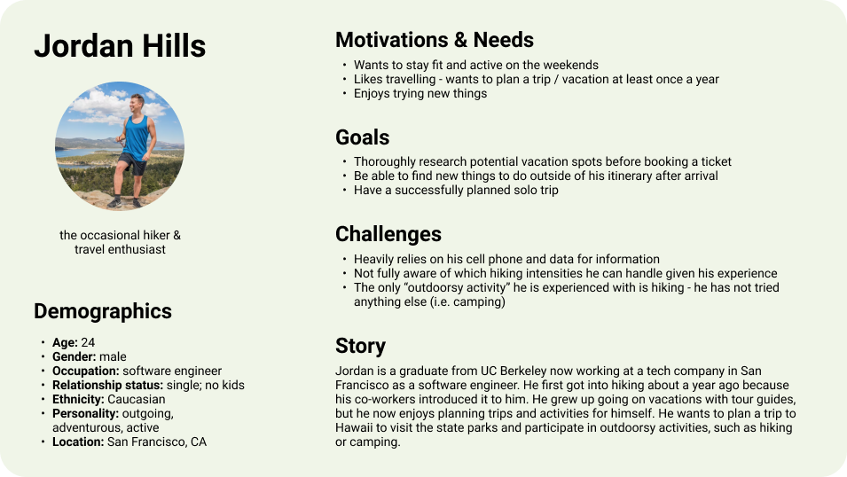

# UX Storytelling
## Assignment 04: Personas and Scenarios
Vivian Wong, Digital Humanities 110: User Experience and Design

### Purpose of UX Storytelling
blah blah blah

### Design Features to Explore
> * test
> * test 

## Personas and Empathy Maps
### Persona 1: Jordan Hills

### Jordan's Empathy Map

### Persona 2: Miley Pham
> insert image

### Miley's Empathy Map
> insert image
