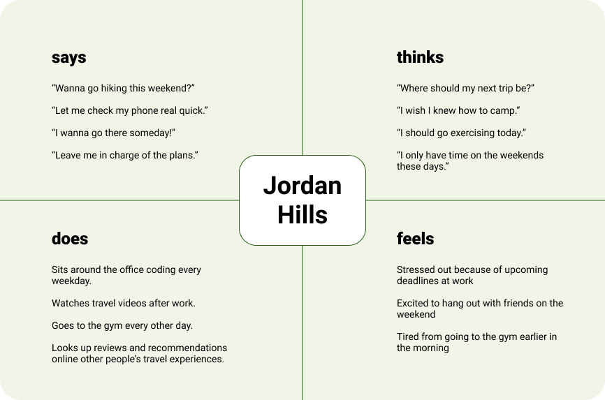
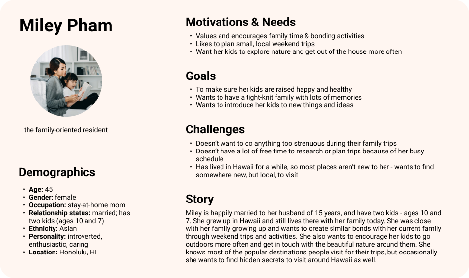
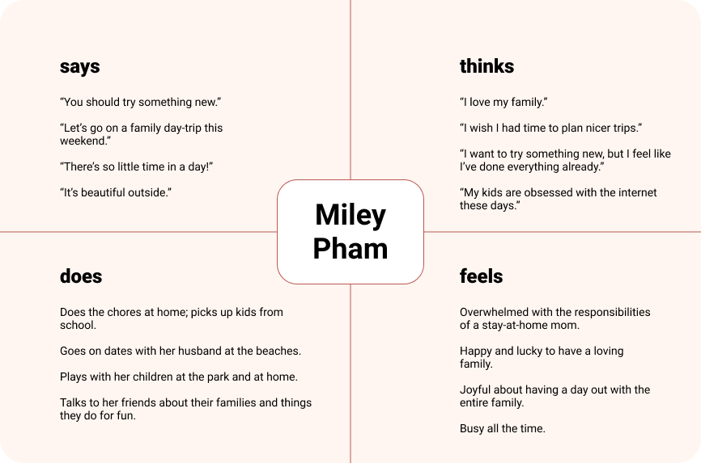
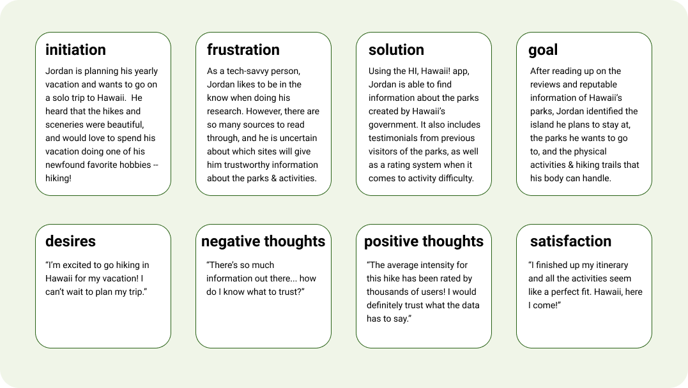

# UX Storytelling
## Assignment 04: Personas and Scenarios
Vivian Wong, Digital Humanities 110: User Experience and Design

### Purpose of UX Storytelling
> The purpose of UX storytelling is to empathize with the user and to see things from their perspective as the designer. Through usability testing and contextual inquiry interviews, we are able to get a glimpse of other people's personal experiences with the topic we are designing for. Using this qualitative data, we can create personas that represent our user, as well as scenarios they may face, as part of the UX storytelling process. This process allows  the designer to create a product that suits the needs of various users across demographics.

### Design Features to Explore
> * Review Feature - read reviews from people who previously visited the state park and their experiences
> * Park Finder - find new parks by easily identifying which parks you have already visited. this feature will also showcase activities around the area.
> * The current working title for my project is called HI, Hawaii!.

## Personas and Empathy Maps
### Persona 1: Jordan Hills

### Jordan's Empathy Map

### Persona 2: Miley Pham

### Miley's Empathy Map

## Scenarios and Journey Maps
### Jordan's Scenario - The Recommendation Feature
Jordan is a young, male software engineer in the Bay Area creating his plan for his yearly vacation. He has really enjoyed picking up hiking as a hobby, and after hearing about the beautiful parks and trails Hawaii has to offer, he plans a solo trip to Hawaii full of physical activities. Since he only goes on vacation once every year, he wants to create a thorough itinerary so that he can do all of the activities he wants to do. One of his favorite parts of travelling is the planning, but he does consider it to be a time-consuming process. 

In his research process for creating his travel plan, Jordan looks up information regarding the different islands, state parks, and activities that he could potentially partake in. He found many different resources, ranging from review sites (like TripAdvisor) to personal blogs. However, the information isn't comprehensive and is contradictory at times. Being a numbers guy, he is more trusting if there was a larger pool of reviews or ratings. With all of the different personal accounts varying across the internet, it is a bit overwhelming for Jordan to make the right decision and to figure out the reputability of everyone's opinions.

However, with the HI, Hawaii app, Jordan knows that it is a resource created by Hawaii's government - giving him a greater sense of trust with the source. The app includes government created content and guides about the parks, as well as a reviews and ratings system. Users of the app are able to leave quick ratings on important factors, like intensity of an activity, or length. Users can also leave reviews of their experience at the park and which activities they participated in. Since leaving a rating or review is less commitment compared to writing a blog post, this could encourage more users to leave reviews as a result. The more reviews and ratings there are, the more trustworthy the app is in Jordan's eyes.

After reading the information on the HI, Hawaii app, Jordan is able to identify which island he wants to stay at during his vacation. He also figured out exactly which parks to visit, as well as which hiking trails he can physically handle. Additionally, the ratings helped him figure out appropriate time estimates for each activity, which allows him to plan out his itinerary perfectly and maximize his vacation time.

### Miley's Scenario - The Park Finder
Miley is a middle-aged stay-at-home mom who has lived in Hawaii her whole life. She values family, and loves to plan family outings in order to strengthen bonds and memories with her husband and two kids. She wants to plan a weekend trip, but noticed that her kids have been tired of visiting the same location multiple times in the past. She knows that there are probably some secret locations in Oahu she has yet to visit, and wants to plan a weekend trip for her family to visit a new place they have yet to experience. 

Given that Miley has had so many things on her plate, she is prone to forgetting many things - including places she has visited in the past. 
