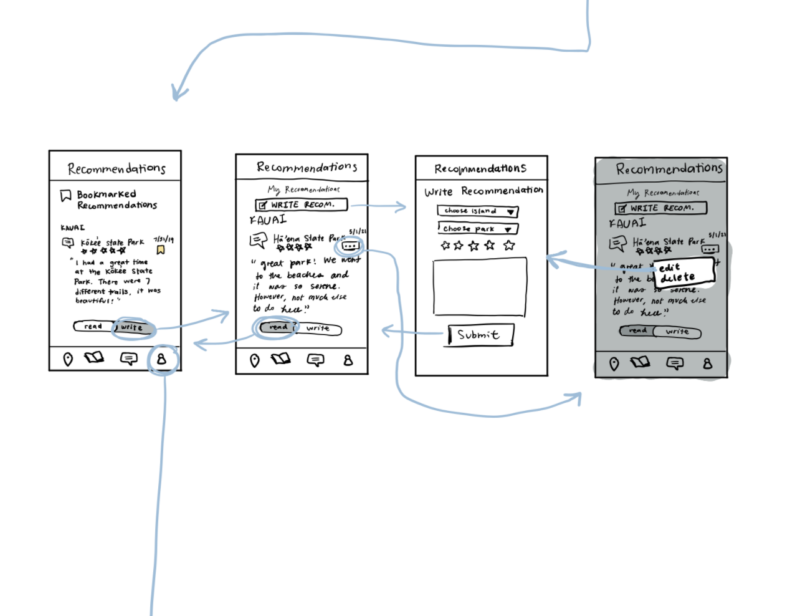
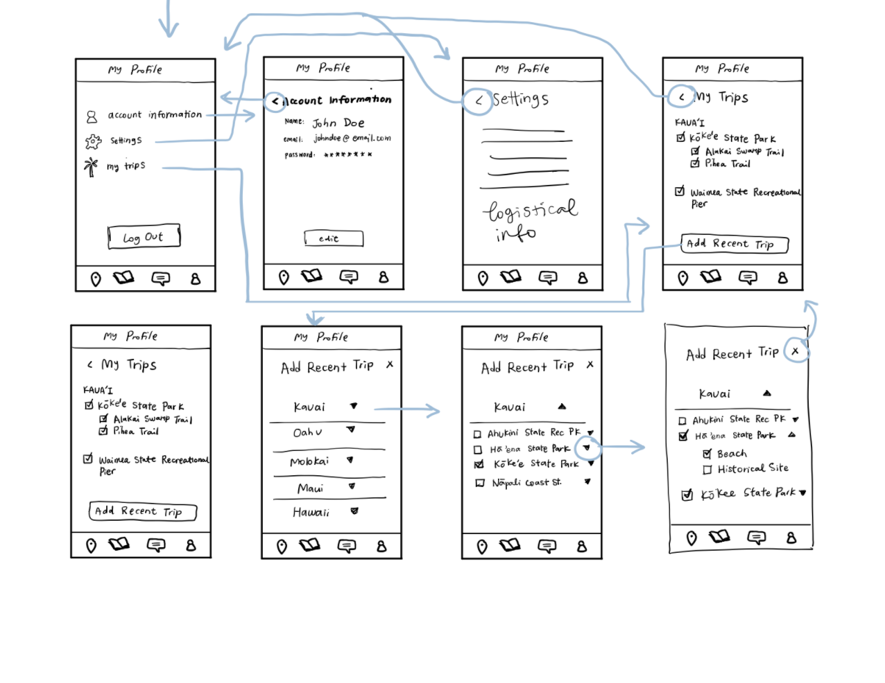
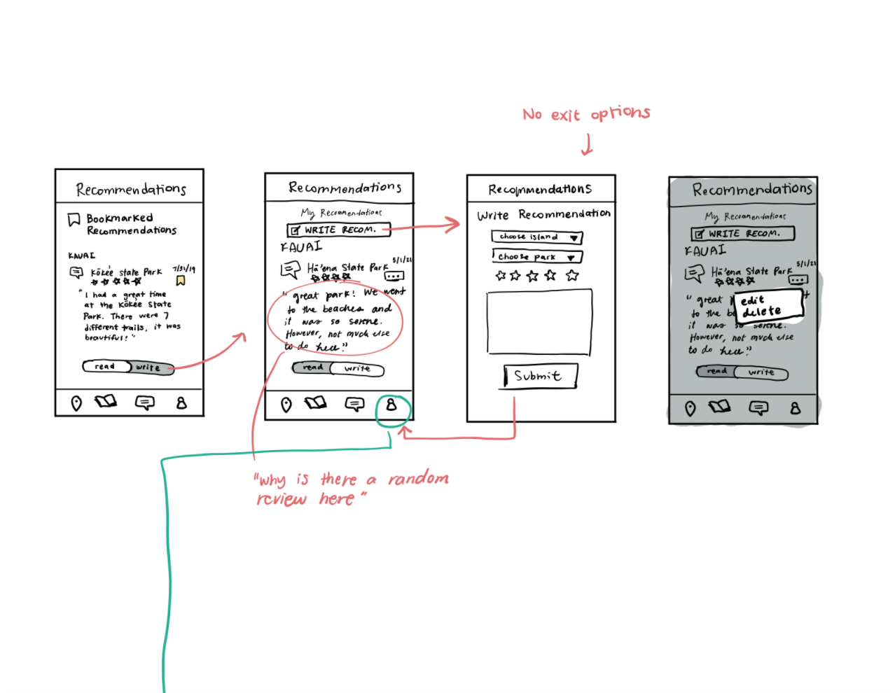
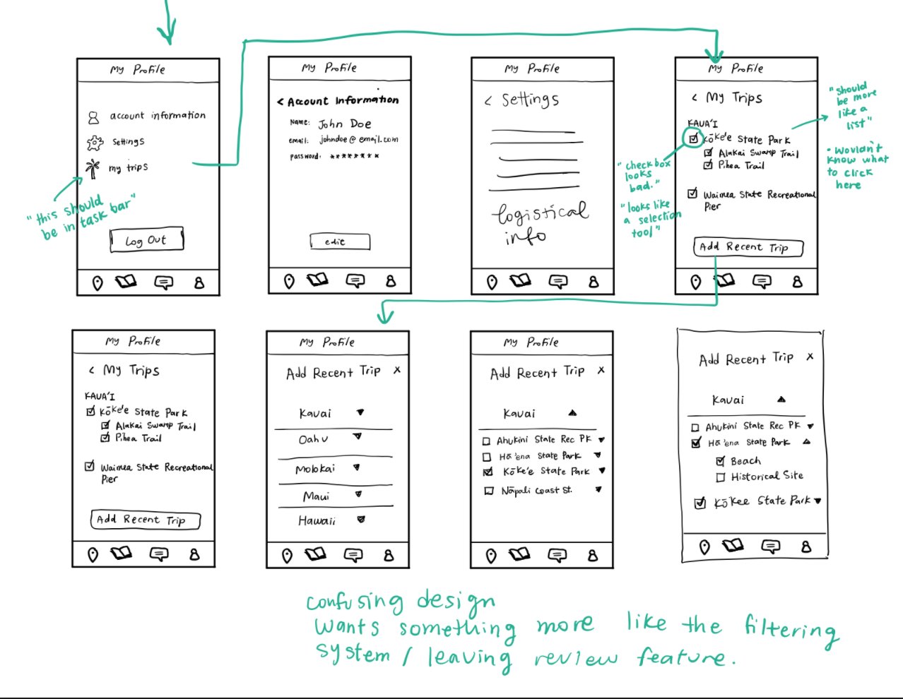

# Assignment 05: Low Fidelity Prototype
Vivian Wong, Digital Humanities 110: User Experience and Design

## Introduction

### Project's Purpose
The purpose of this project is to create a comprehensive guide to Hawaii's state parks for visitors and residents of Hawaii. People use different sources when researching information about new locations, some of which include government websites. However, the current information displayed on the government website is not enough for people to rely on. My project hopes to create a comprehensive tool that includes maps, guides, reviews, and personalized lists when it comes to researching state parks in Hawaii. 

### Purpose of Low Fidelity Prototyping
The purpose of low fidelity prototyping is to begin brainstorming for potential features and interactions within the app. Through quick sketches (like paper prototyping), less time is invested into the initial designing phase of the project - which can save time and costs in the future when it comes to creating mid and high fidelity designs. It would be more effective to scratch an idea or identify ways to improve the design at the low fidelity stage, rather than the high fidelity stage.

### User Research & Personas
Through contextual inquiry, I discovered that the convenience factor and first-person accounts of experiences played a big role in the decision-making process when it comes to choosing a new place to visit. Additionally, the location itself has an impact on a user's decisions on what activities they would prefer to do. Also, going into a trip with extensive research on the area is preferred compared to being unprepared. 

Based on this research, I created two personas: a young man living in San Francisco who enjoys hiking and travelling in his free time, and a middle-aged stay-at-home mom living in Hawaii who enjoys planning small weekend trips with her family. I wanted to make sure both residents and visitors were being represented, and that their scenarios would address the key points I discovered in my contextual inquiry research. 

With my research and personas, I identified some key features I wanted to explore:
1. I wanted to create a review feature, which would allow users to read and leave reviews on parks that they visited.
2. I wanted to make the park finding process much easier, and have the guides to each park readily available. I also wanted to make sure that users could keep track of which parks they've already visited within the app to make finding new parks an easier process.

### Tasks and Features Tested
* Identifying a state park the user wants to visit
* Finding and creating reviews
* Keeping track of previous trips and parks visited

## Wireframes and Intended User Flow

## Low Fidelity Prototype Testing

### Problems Faced & Feedback
* Identifying a state park the user wants to visit
> For this task, the user had no problem with finding a state park on the map. While they noticed the list feature, they chose not to interact with it and accessed the guide based on the pins on the map. I had another tab of the app which allowed users to research the resources more thoroughly through a search and filter feature. This would allow the user to make a more specific search for what they would want to visit and see. However, there was confusion in the way this feature was organized. The user did not understand the dropdown design feature and found it unnecessary for the search and filtering processes to be separated. This resulted in the user moving on to the next activity instead of the completion of the activity.
* Finding and creating reviews
> The user was able to complete this task without any problems. However, they did note that the section where users can read their previously posted reviews was confusing and asked "why is there a random review here" upon seeing it. They also did not realize that there was a button in place of the bookmark feature (which is present when reading other people's reviews) which would allow them to edit or delete old reviews. 
* Keeping track of previous trips and parks visited
> For the trip tracker portion of the app, my thought process was to include it in the profile section, since this was a more personal aspect of the app compared to the other tabs. However, upon seeing the trip tracker in the profile, the user immediately said that it should be included in the navigation bar on the bottom of the screen. This feature was also designed to act as a checklist of previously visited places, but the user got confused with the design and mentioned how they "wouldn't know what to click here". They mentioned that they would like to see something similar to the previous designs created for the review section or filtering section.

## Reflection
