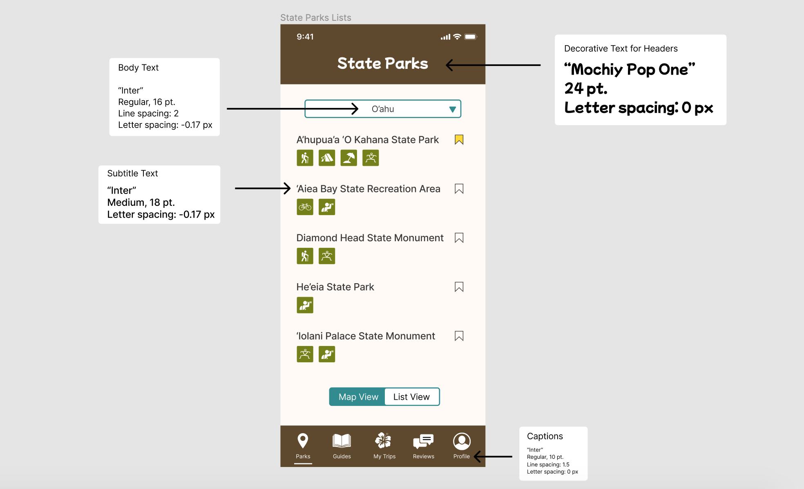
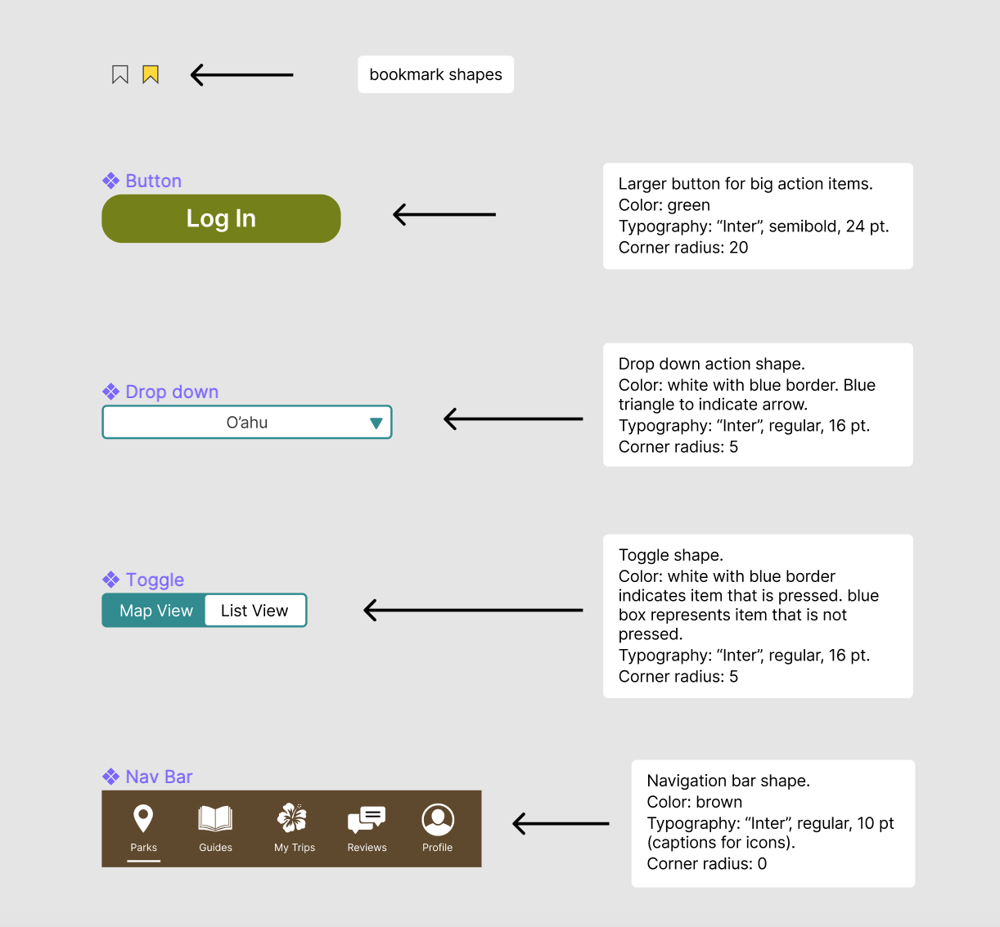
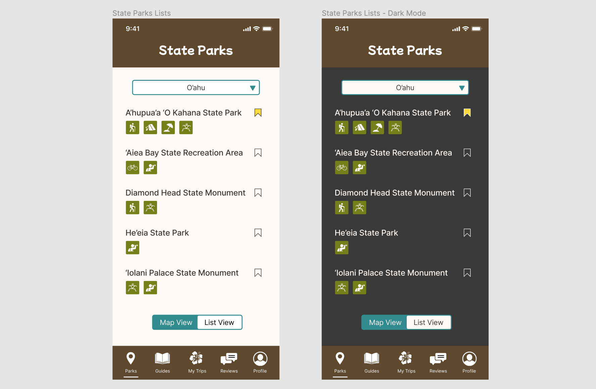
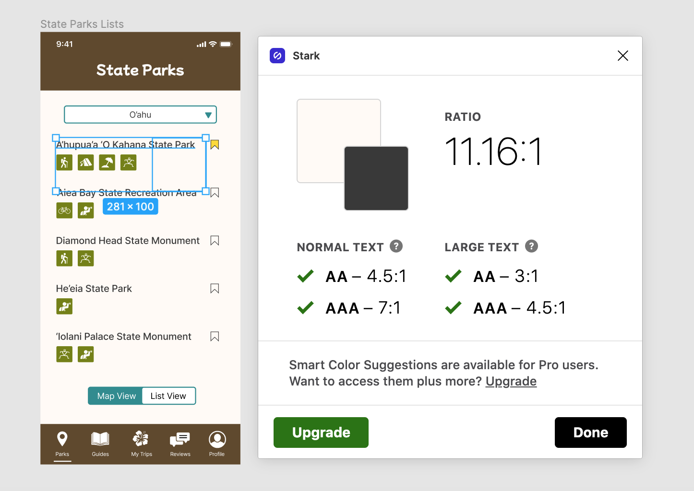
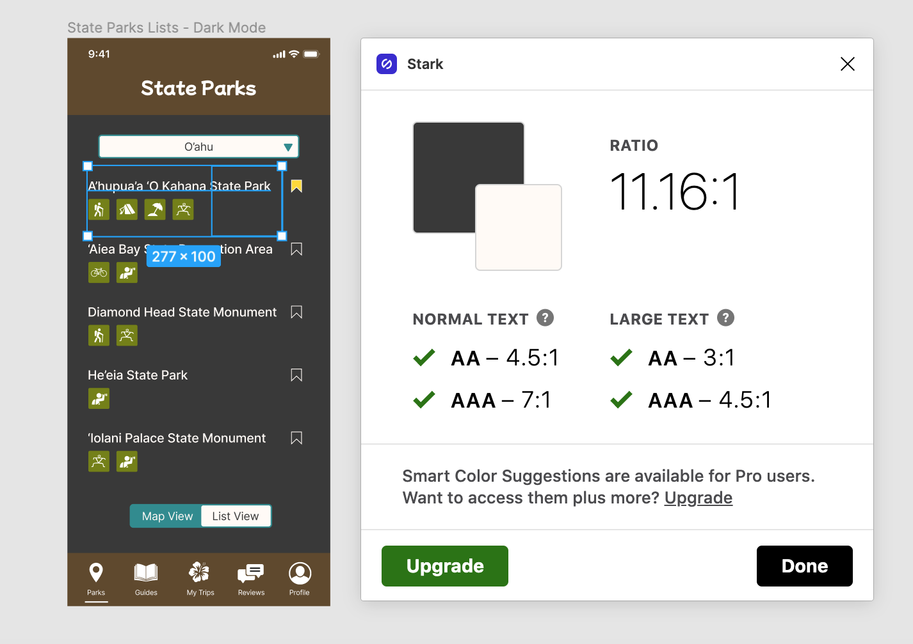
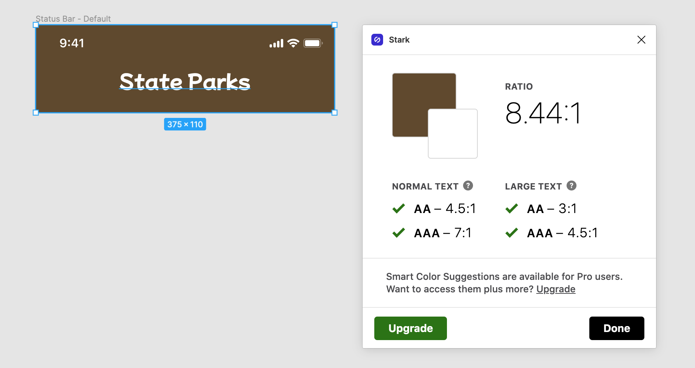

# Assignment 06: Interface Design
Vivian Wong, Digital Humanities 110: User Experience & Design

## Introduction
The purpose of my project is to provide residents and visitors of Hawaii with a comprehensive guide to all the state parks that Hawaii has to offer. The app, called HI, Hawaii!, will include maps, guides, reviews, and a personal trip tracker for Hawaii's state parks. 

The purpose of this interface design is to convert the low-fidelity designs into a digitized design with a developed style (i.e. color palette, shape variation, typographic variation). Creating this graphic design system and making it reusable within Figma will make the process of creating additional frames easier and quicker in the future. 

I created the list view of the park finder feature in Figma for my example wireframe. This is what it currently looks like:

Here is the link to my Figma file, which shows the full screen design: [LINK]

## Screen Design

### Typographic Variations

### Shape Variations

### Color Schemes

### Layout Test

## Accessibility Check (Color Contrast)
### Accessibility Check for Light Mode

### Accessibility Check for Dark Mode

### Accessibility Check for Header

## Impression Test

