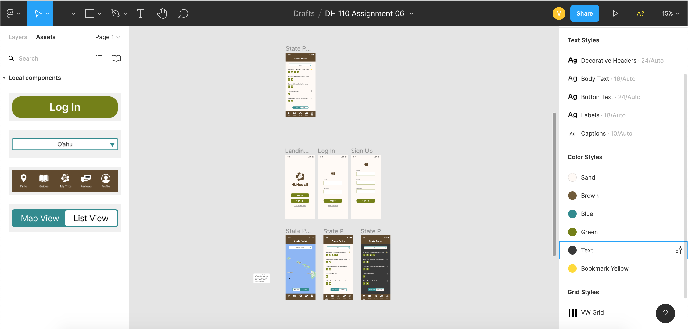

# Assignment 06: Interface Design
Vivian Wong, Digital Humanities 110: User Experience & Design

## Introduction
The purpose of my project is to provide residents and visitors of Hawaii with a comprehensive guide to all the state parks that Hawaii has to offer. The app, called HI, Hawaii!, will include maps, guides, reviews, and a personal trip tracker for Hawaii's state parks. 

The purpose of this interface design is to convert the low-fidelity designs into a digitized design with a developed style (i.e. color palette, shape variation, typographic variation). The process of digitizing my low-fidelity design was done through Figma. The dimensions of the frames for these designs were based on the iPhone 11 Pro / X screen size. I utilized various resources to create the graphic design system, including Google Fonts, Hawaii's Division of State Parks website, and Material Design. Creating this graphic design system and making it reusable within Figma will make the process of creating additional frames easier and quicker in the future.

I created the list view of the park finder feature in Figma for my example wireframe. This is what it currently looks like:

Here is the link to my [Figma file](https://www.figma.com/file/1j8qRtvSNIq4P38Ih8IAZZ/DH-110-Assignment-06?node-id=0%3A1), which shows the full screen design: 

https://www.figma.com/file/1j8qRtvSNIq4P38Ih8IAZZ/DH-110-Assignment-06?node-id=0%3A1

## Screen Design

### Typographic Variations

### Shape Variations

### Color Schemes

#### Color Palette

#### Light and Dark Mode

### Layout Test (using a 10 px grid)

## Accessibility Check (Color Contrast)
### Accessibility Check for Light Mode

### Accessibility Check for Dark Mode

### Accessibility Check for Header

## Impression Test
Please find the recording of the impressions test here: https://drive.google.com/file/d/1-FcbM2Wp1sANFVSfpo34EvAu-XJAxIRT/view?usp=sharing
> Note: My interviewee wanted this video to be kept private, so I shared the file with you on Google Drive. The link to the video should work if you are logged into your email! Please let me know if there are any issues, thank you!

### Summary of Findings
With the 5-second first impressions test, the interviewee remembered the colors they noticed, the general content of the text, and a filter option (referencing the drop-down feature). 

When I asked for their opinion on the design, these are some of the key takeaways from the interview:
> Referencing the decorative header text: "I don't really understand why it is in that font compared to the rest of the app."

> Referencing the toggle button between the map and list views: "I feel like there might be a better way to indicate the toggle between the back and the forth of that." 

> Referencing the activities icons: "Right now, I would have to make assumptions on what those icons are."

> Referencing the color palette: "I like the white and the blue, it kind of reminds me of the ocean and sand. And the green with the palm trees. I'm just not a big fan of the brown."

In summary, the interviewee noted how the color scheme matched the inspiration that I used (the images from Hawaii's Division of State Parks website). However, they did not like the brown color that was used in the branding of the website. They also noted how there could be ways to make the app more convenient, such as with the activities icons and ways to improve the toggle button. I was able to use this feedback to create a new toggle button before writing up this documentation, which is why the toggle button design looks different between this documentation and the impressions video. 

## Design System

My graphic design system saved in Figma

## Summary of Graphic Design

### Typeface family and size
- Header: I chose a decorative typeface called "Mochiy Pop One", 24 pt

For all other text, I chose a typeface family called "Inter".
- Body text: “Inter”, Regular, 16 pt., Line spacing: 2, Letter spacing: -0.17 px
- Subtitle text: “Inter”, Medium, 18 pt., Letter spacing: -0.17 px
- Caption text: “Inter”, Regular, 10 pt., Line spacing: 1.5. Letter spacing: 0 px

> How I made the decision: I chose the decorative typeface "Mochiy Pop One" because I felt like it looked like a fun font that was still legible. I didn't want to overuse the font, which is why I opted to use it scarcely for areas like the headers, or for the name of the app on the landing page. I used a 24pt size for the title text because it was 1.5x the size of the size of my body text. 

> I chose the typeface family "Inter" for everything else in the app because it is a sans-serif font that looks clean and easy to read. It also had multiple weight options, which all looked great. I used a 16pt size for my body text in regular weight because it was suggested, and I felt like it was a good size when I tested it on the wireframe. I used a 18pt size for my subtitle text in medium weight for the subtitles. I chose a different font weight because I wanted to create a stronger emphasis on the information provided here. I also made the font size a bit larger so that it is more noticable than the body text, but wasn't overbearing the page. I used a 10pt size for my caption text in regular weight because this size fit the best underneath the icons that I wanted to use this text for without going too small.

### Color scheme
- background color (sand): FFFAF6
- text color (black): 393939

Accent colors
- brown (for headers and footers): 60492C
- blue (for interactive elements): 2D8B90
- green (for interactive elements): 748106

> How I made the decision: For the color scheme, I wanted to use Hawaii's Division of State Parks website as inspiration, as well as the images of Hawaii displayed on their front page. The colors I chose (sand and blue) were very nature and beach themed, which is inspired by what Hawaii is best known for. The brown and green was also inspired by the branding used on Hawaii's Division of State Parks website, so overall, I am happy with the final color scheme. My interviewee also noticed how the colors reminded them of the beach and palm trees, which was my intention with these colors.

### Layout grid and spacing
- for the layout grid, I used a 10 pixel grid, where the distance between each grid space represented 10 pixels. 
> How I made the decision: I chose to use a grid because I was familiar with grids from my past graphic design experiences and found them easier to use and organize spacing based on my personal experiences. I also used 3 grid spaces (aka 30 pixels) a lot for the design elements and spacing. For example, the drop down menu's height was 3 grid spaces, the gutter was 3 grid spaces, and the distance between each state park component was 3 grid spaces as well. This was done to provide more consistency within the design when it came to spacing.
