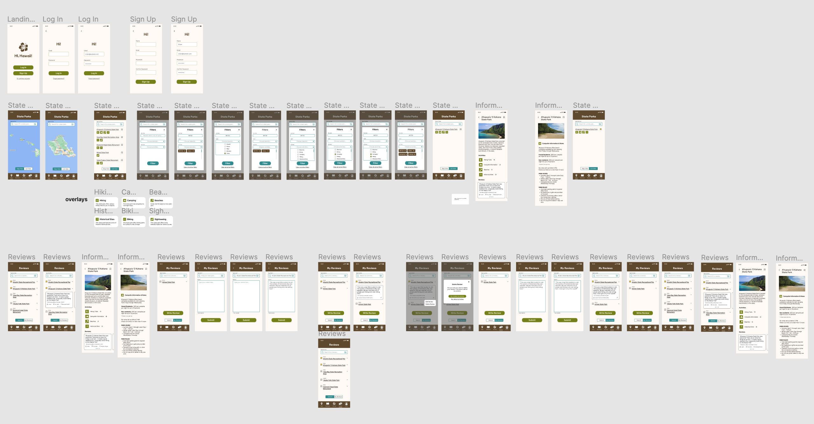
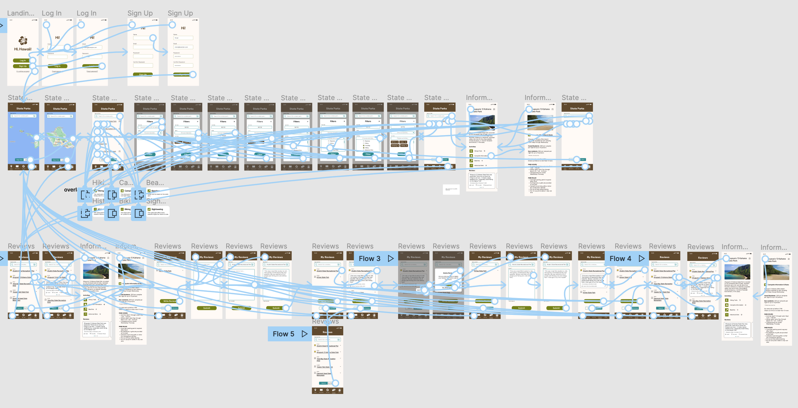
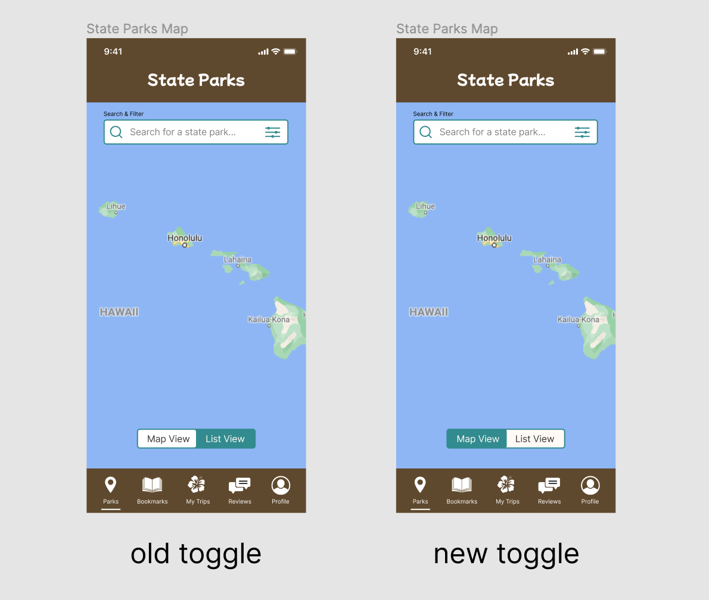

# Assignment 07: High Fidelity Prototype
Vivian Wong, Digital Humanities 110: User Experience & Design

## Introduction
The purpose of my project, which is called the HI, Hawaii! app, is to provide residents and visitors of Hawaii with a comprehensive guide of the different state parks Hawaii has to offer, as well as the different activities that are available to do there. The purpose of this phase is to create an interactive prototype that mimics how the app would work if it were to be fully designed and developed. Using the prototype, I am able to conduct cognitive walkthrough interviews in order to understand how people would naturally interact with the app when asked to do certain tasks. I am able to observe if there are any points of confusion or frustration and make further adjustments as necessary before delivering a final product.

## The Tasks and Prototype

I designed and prototyped two tasks that the high fidelity prototype supports:

#### Task 1: State Parks Filtering Feature
* The prototype allows the user to interact with the filtering feature, which allows the user to filter by zip code, island, or activities. This is where the user can find comprehensive guides on the state parks and the activities that they can do there.

#### Task 2: Writing a Review
* The prototype allows the user to interact with the review feature, which includes reading other user's reviews, reading the past reviews the user wrote, writing and publishing a new review, and editing and deleting past reviews.

Here is the link to my [Figma file](https://www.figma.com/file/1j8qRtvSNIq4P38Ih8IAZZ/DH-110-Assignment-06?node-id=0%3A1) with the high-fidelity designs and wireflow. You can find the link to the interactive prototype [here](https://www.figma.com/proto/1j8qRtvSNIq4P38Ih8IAZZ/DH-110-Assignment-06?node-id=4%3A3&scaling=scale-down&page-id=0%3A1&starting-point-node-id=4%3A3).

## Images of Wireflows with Interface Design

> This is an image of the Figma file with all of the interface design frames (without wireflows)

---

> This is an image of the Figma file showcasing all of the wireflows and how the interface design frames are linked to one another (with wireflows). For a clearer distinction between the flows, please reference the Figma file attached above or linked [here](https://www.figma.com/file/1j8qRtvSNIq4P38Ih8IAZZ/DH-110-Assignment-06?node-id=0%3A1).

## Cognitive Walkthrough
I conducted two cognitive walkthrough sessions. Please find the links to the videos here:
* [Cognitive Walkthrough 1](https://drive.google.com/file/d/10bB17R0WoewTFybLEHA4p5zGgnMgPnwX/view?usp=sharing)
* [Cognitive Walkthrough 2](https://drive.google.com/file/d/1Aee81gkl8PBSOIDF6YucV_Ysd83pWWBA/view?usp=sharing)

The Process: I conducted the interview for Cognitive Walkthrough 1 before the interview for Cognitive Walkthrough 2. I conducted both interviews on the same day, but I was able to make some minor changes to my prototype based on the feedback from the first interview, which is why there may be some slight differences in the interactive prototype between the two videos. I asked the participants to do the following tasks:

#### Task 1: State Parks Filtering Feature
* I wanted the user to use the filtering feature and see how they would interact with the different elements on the page. I also wanted to see if they would know where to click in order to access the comprehensive guides about the state park.

#### Task 2: Writing a Review
* I wanted the user to write a review for a state park. I also wanted to see if they would know how to edit the review after it was posted.

## Summary of Findings:

### Cognitive Walkthrough 1
* This interview went pretty smoothly in my opinion. My participant does not have any previous experience with using Figma or prototypes, but they were still able to interact with the prototype and completed the tasks. However, I think I should have explained to them how Figma prototypes worked, because I noticed a few points of frustration were caused because of the nature of the Figma cursor (the cursor a large circle, so you would assume anything touching the circle would get clicked, but you have to center the circle cursor to click on items - example at the 5:48 timemark).
* I had also prototyped a specific flow which showed off how the interactions would work, but I didn't preface the interview with this information - leading to a bit of confusion. In Cognitive Walkthrough 2, I made sure to preface the cognitive walkthrough with this information.
* At around the 4:56 mark of the video, the participant clicked the "Search" button, which was linked to the wrong frame in the wireflow. This resulted in the participant having to start the task over and write the review again. I was able to fix this mistake in my current prototype.
* At the 6:35 timestamp, I explicitly asked for feedback about the designs and got the following insight:
> The toggle at the bottom was misleading because the color of the active button was white on top of a blue background, but they thought that the blue color represented the active button.

* I ended up changing the toggle design before I conducted the interview for Cognitive Walkthrough 2.

> a pretty minor change

### Cognitive Walkthrough 2
* For this interview, I made sure to preface the cognitive walkthrough with the information that I had missed from the first interview (about the prototype not having every single element being interactive).
* At the 2:00 timemark, the participant noted that the toggle that was colored blue was the one that they were currently on - justifying the change in the toggle made based off the feedback from Cognitive Walkthrough 1.
* At the 4:15 timestamp, the user noted how they assumed that the bookmarked parks represented the park that the persona has previously been to. As a result of this feedback, I want to create an indicator that will make it clearer on which parks have been previously visited by the user.
* Overall, I felt like there were less complications in the interactions when it came to the second cognitive walkthrough. I think this may be because of different factors, such as fixing up minor details based on the feedback from Cognitive Walkthrough 1 when it came to the toggle buttons. I also believe since the second participant was already farmiliar with Figma, that made it easier to interact with the prototyping tool compared to the first participant, who had never used Figma before.

General Notes:
* I noticed that I jump in to help the user out if they've been stuck on something for a while (example: Cognitive Walkthrough 2 - 2:44). I think it's a force of habit for me in my everyday life, so I have to practice being better at letting the user figure things out for themselves without my help. 
* Overall, I thought the cognitive walkthroughs went great. I also liked getting the opportunity to conduct two interviews this time, and having different perspectives really helped a lot in terms of the feedback. 
