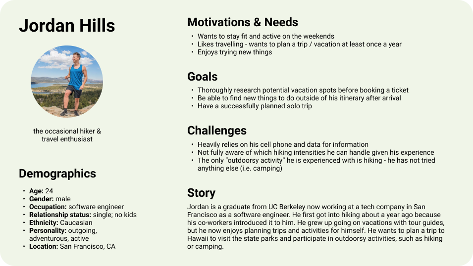
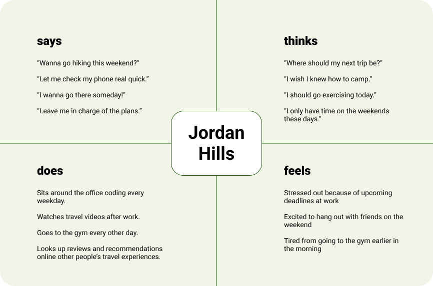
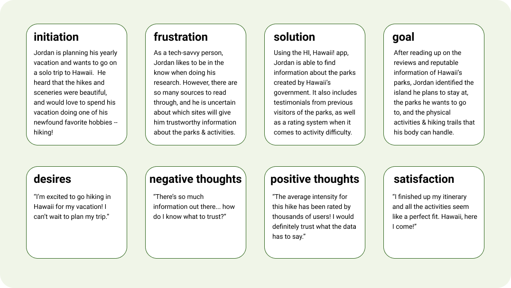
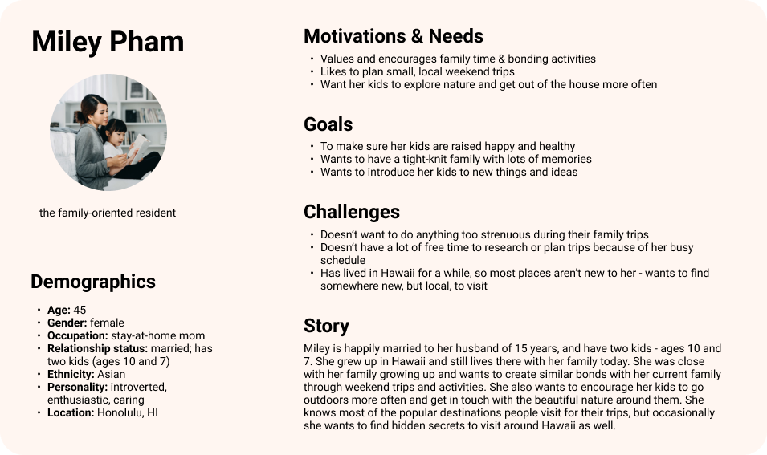
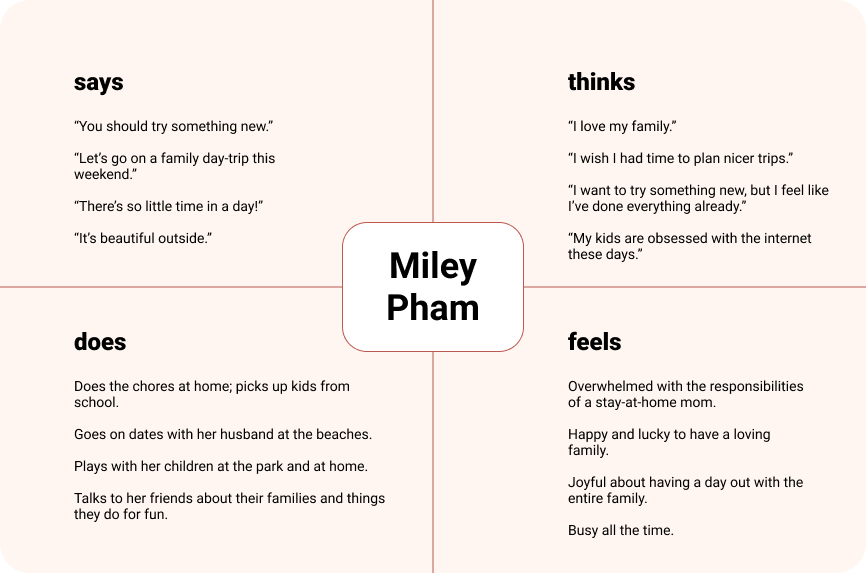
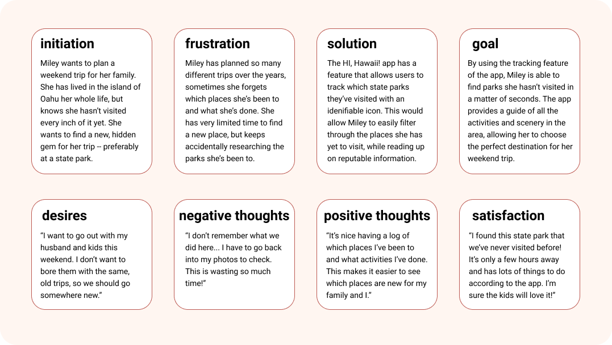
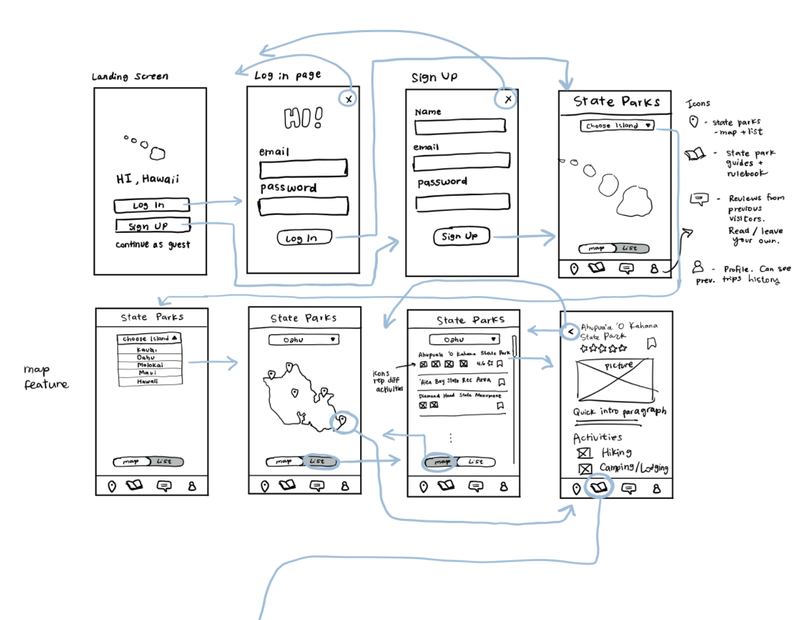
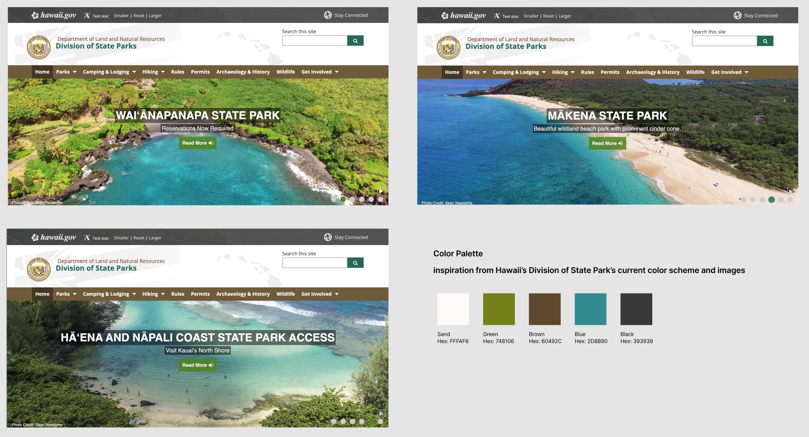
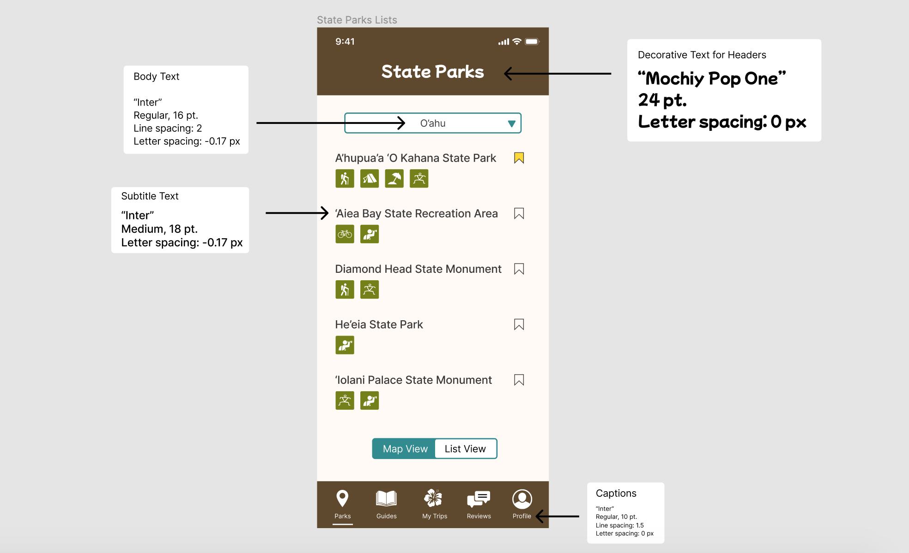

# HI, Hawaii! - a state parks finder for residents and visitors of Hawaii

## Assignment 08: Pitch

Vivian Wong, Digital Humanities 110: User Experience & Design

## Introduction

This project was inspired by the beautiful state parks and beaches that Hawaii is known for. I took large inspiration from Hawaii's Department of Land and Natural Resources website (which I conducted a heuristic evaluation and competitor analysis for). After seeing the website, I wanted to create a state parks finder that would consolidate all of the information regarding Hawaii's state parks, guides, and recreational activities since users have to search through multiple sites in order to find all of the information needed for their trips. The project's purpose is to serve as a platform for residents and visitors of Hawaii to find and explore the beautiful scenery and activities that the islands have to offer.

## Design Statement
Currently, people rely on a variety of websites in order to find information when planning their trips. Additionally, when I was conducting usability testing on Hawaii's Department of Land and Natural Resources website, there were various points of confusion my participant had when interacting with the site, which I wanted to address in my project. I wanted to consolidate as much information and features within my project so that it could be the ultimate resource for planning trips to Hawaii's state parks.

## Competitor Analysis
I had initially intended for my project to focus on tourism, so for my competitor analysis, I decided to look at two websites. One website was by Hawaii's Department of Land and Natural Resources -- Division of State Parks, which focuses on providing users with information regarding recreational activities and state parks. The second website was by Hawaii's Department of Business, Economic Development and Tourism, which provides users with information regarding locally owned businesses and marketplaces in Hawaii. 

I conducted heuristic evaluations for both of these websites because they are both related to tourism, but I eventually shifted the focus of my project towards Hawaii's state parks and creating improvements upon what the Department of Land and Natural Resources already has. I wanted to redesign this website and create a project that was more interactive and personalized for users for when they plan their trips. An image of the Department of Land and Natural Resources website can be found below. 

[Additional information regarding the heuristic evaluations and competitor analysis can be found here...](https://github.com/vivianwong19/DH110-2021F/tree/main/assignment01)

## Usability Testing
After the heuristic evaluations and competitor analysis, I conducted a pilot usability testing session of the Department of Land and Natural Resources website to see how a new user would naturally interact with the website. The purpose of usability testing is to analyze the three main metrics of usability when it comes to UX/UI: effectiveness, efficiency, and satisfaction. I conducted the test in an in-person environment, and the participant was someone who had never been to Hawaii before. Through this interview, I was able to get a better sense of how someone would interact with the website if they were planning a trip to a location they had never visited before. The usability testing session allowed me to observe the participant and identify areas of improvement within the site.

For the usability testing session, I created a survey for the participant to fill while they were doing the tasks. I designed three main tasks for my participant to do:
1. Finding a specific state park in Hawaii based on the information provided
2. Finding information about a campsite and nearby activities at a state park
3. Finding information about Hawaii's native wildlife

[More information about the usability testing session can be found here...](https://github.com/vivianwong19/DH110-2021F/tree/main/assignment02)

## User Research
After conducting the pilot usability test of the Department of Land and Natural Resources website, I conducted a contextual inquiry interview. The contextual inquiry interview comprised of a combination of interviewing and participatory observation. I was able to interview a new participant who enjoys outdoorsy activities, such as hiking. This participant has also been to Hawaii before, so I was able to get insight from someone who was familiar with the location. 

The contextual inquiry included a question & answer section, as well as two activities. The first activity was to go onto the internet to research and identify a state park in Hawaii they would be interested in visiting. During this task freely chose to interact with the Department of Land and Natural Resources without any guidance from me, which differed in comparison to the usability testing session. The second activity was to create an itinerary for the state park my participant identified, which helped me see how a user would choose find and choose activities at a specific location. Some of the biggest takeaways from the contextual inquiry interview which further helped inspire the design for my project included:
1. Recommendations and first-person accounts are important when it comes to finding a new location
2. Extensive research and planning are preferred over spontaneous trips
3. Convenience is a major factor when it comes to planning activities
4. Activity preferences can change based on location

[Read more about the contextual inquiry here...](https://github.com/vivianwong19/DH110-2021F/tree/main/assignment03)

## UX Storytelling
After the user testing phase, I started on the UX story telling phase. The purpose of UX storytelling is to empathize with the user and to see things from their perspective as the designer. Using the data gathered from the usability test and contextual inquiry, I created personas that represent the user for the app, as well as scenarios they may face, as part of the UX storytelling process. 

I created two personas: Jordan Hills and Miley Pham. Jordan represents a user who doesn't live in Hawaii, but he enjoys travelling and wants to visit the state in order to partake in physical recreational activities. Miley represents a user who has grown up in Hawaii her whole life and is now raising a family in Hawaii as well. She enjoys planning small weekend trips to areas local to her island, but doesn't have much time to do so. After creating the two personas, I also created empathy maps and journey maps for each persona. The empathy map represents what the persona says, thinks, does, and feels. The journey map walks through a scenario where the persona interacts with the design of the project, as well as their though process in regards to the interactions. 

|Jordan's Persona|Jordan's Empathy Map|Jordan's Journey Map|
|---|---|---|
||||

|Miley's Persona|Miley's Empathy Map|Miley's Journey Map|
|---|---|---|
||||

The personas helped me figure out which features to prioritize, especially when taking into consideration the feedback I had previously received from the usability testing and contextual inquiry. I was able to use this information in order to start working on the designs and prototype for my project.

[Find more details about the UX storytelling process, personas, empathy maps, and journey maps here...](https://github.com/vivianwong19/DH110-2021F/tree/main/assignment04)

## Low Fidelity Prototype
The low fidelity prototype phase allows for a cost-effective and quick method for testing initial ideas. The purpose of low fidelity prototyping is to begin brainstorming for potential features and interactions within the app. Through quick sketches (like paper prototyping), less time is invested into the initial designing phase of the project. This is beneficial because designs are extremely subject to change in the beginning stages of designing. I created my low fidelity prototype using an iPad and an app called Notability. Below is an example of the low fidelity prototype I created for this project.

The blue arrows indicate the intended flow of the prototype and which buttons would lead to which interactions. The example image shows the intended wireflow for one of the key features I was designing for (identifying and finding information about a state park in Hawaii). With my research and personas, I had identified some key features I wanted to explore, and created some tasks that I had a participant help test. The tasks included:
- Identifying a state park the user wants to visit
- Finding and creating reviews
- Keeping track of previous trips and parks visited

[Read more about the low fidelity prototype here...](https://github.com/vivianwong19/DH110-2021F/tree/main/assignment05)

## Wireframe and Design Variations:
After getting feedback from a participant on the low fidelity prototype, I started creating the designs on Figma. Before creating the high fidelity prototype, I made one wireframe with different design elements and variations. The purpose of the interface design is to create a design system and digitize the low fidelity design into one with a developed style (color palette, shape variation, and typographic variation). This will make it easier for designing multiple frames for the high fidelity mockup. Attached below are images of the different design element variations that I created for my project.

[Read more about the project's interface design and graphic design variations here...](https://github.com/vivianwong19/DH110-2021F/tree/main/assignment06)

| Color Palette |  |
| --- | --- |
| Shape Variation |  |
| Typographic Variation |  |

## High Fidelity Prototype
After the low fidelity prototype testing and finalizing the graphic design variations, I began working on the high fidelity prototype in Figma. The purpose of the high fidelity prototype is to create an interactive prototype that mimics how the app would work if it were to be fully designed and developed. With the prototype, I am able to ask participants to do tasks and observe how they would naturally interact with the app. This allows me to identify if the app is being used as intended, or if there are any points of confusion that I'd have to address before delivering a final product.

The main features that were prototyped in the high fidelity prototype were the "Parks" tab, which allows the user to filter through state parks and find information about the parks; and the "Reviews" tab, which allows the user to read other user's reviews, read their past reviews with options to edit or delete the content, or leave a new review.

[Read more about the high fidelity prototype here...](https://github.com/vivianwong19/DH110-2021F/tree/main/assignment07)

Please find the link to the project's Figma file [here](https://www.figma.com/file/1j8qRtvSNIq4P38Ih8IAZZ/DH-110-Assignment-06?node-id=0%3A1). The interactive prototype of the project can be found below. 

<iframe style="border: 1px solid rgba(0, 0, 0, 0.1);" width="800" height="450" src="https://www.figma.com/embed?embed_host=share&url=https%3A%2F%2Fwww.figma.com%2Fproto%2F1j8qRtvSNIq4P38Ih8IAZZ%2FDH-110-Assignment-06%3Fnode-id%3D4%253A3%26scaling%3Dscale-down%26page-id%3D0%253A1%26starting-point-node-id%3D4%253A3%26show-proto-sidebar%3D1" allowfullscreen></iframe>

## Evaluation and Revision History 

During the prototyping phase (low fidelity, wireframe and design variations, and high fidelity), I was able to conduct a series of interviews and tests in order to get feedback and make revisions as necessary along the way. This consisted of an accessibility audit, impression test, and cognitive walkthrough.

### Accessibility Audit
I conducted the accessibility audit using a Figma plugin called Stark to check the readability of the text color against the background color ([see here for more information about accessibility checking](https://github.com/vivianwong19/DH110-2021F/tree/main/assignment06#accessibility-check-color-contrast)).

### Impression Test
For the impression test, I did a five-second impression test, where I showed the design on the screen for five seconds, and asked the participant to recall as many details about the design as possible. Afterwards, I shared the design on the screen again and asked for the participant's feedback in general. 

[The documentation regarding the impression test can be found here](https://github.com/vivianwong19/DH110-2021F/tree/main/assignment06#impression-test). The recording of the impression test can be found [here](https://drive.google.com/file/d/1-FcbM2Wp1sANFVSfpo34EvAu-XJAxIRT/view?usp=sharing).

The user noted a few points of critique, which I ended up changing due to the feedback. This includes:
1. Referencing the toggle button between the map and list views: "I feel like there might be a better way to indicate the toggle between the back and the forth of that." - I ended up changing the toggle to one that was rectangular rather than rounded.
2. Referencing the activities icons: "Right now, I would have to make assumptions on what those icons are." - After another user from a later test noted this issue as well, I created overlays for each icon in the final prototype that would provide users with a brief description on what the icons represented.

### Cognitive Walkthrough
For the cognitive walkthrough, I had two participants test my high fidelity prototype and perform tasks that the app was designed for. Please find the recordings for the cognitive walkthroughs here:
- [Cognitive Walkthrough 1](https://drive.google.com/file/d/10bB17R0WoewTFybLEHA4p5zGgnMgPnwX/view?usp=sharing)
- [Cognitive Walkthrough 2](https://drive.google.com/file/d/1Aee81gkl8PBSOIDF6YucV_Ysd83pWWBA/view?usp=sharing)

For the tasks, I wanted the user to:
1. find a state park using the filtering feature
2. write a review for a state park

I was able to make adjustments between the first and second cognitive walkthrough, and was able to notice an immediate improvement with some of the changes I had made in the second cognitive walkthrough session. Overall, the cognitive walkthroughs went well, since both users were able to complete the tasks and provided useful feedback that I was able to apply into the final prototype. 

[Read more about the cognitive walkthroughs here...](https://github.com/vivianwong19/DH110-2021F/tree/main/assignment07#cognitive-walkthrough)

## Pitch Video 
<iframe width="840" height="473" src="https://www.youtube.com/embed/QQ8U4ECVERE" title="YouTube video player" frameborder="0" allow="accelerometer; autoplay; clipboard-write; encrypted-media; gyroscope; picture-in-picture" allowfullscreen></iframe>

The Pitch Video is also accessible via these links on [YouTube](https://www.youtube.com/watch?v=QQ8U4ECVERE) or [Google Drive](https://drive.google.com/file/d/11C4DkRG4vEpO-RefQ9PKCS-zkTAQEBdU/view?usp=sharing).

## Conclusion

In conclusion, I really enjoyed working on this project throughout quarter in Digital Humanities 110. This was one of the most user research heavy projects I have worked on, and I was able to learn a lot of new methods for conducting research. The feedback that I received during my testing sessions was invaluable, since it was able to inspire different features in the beginning, and allowed me to think of new ways to improve the designs during the prototyping stages as well. 

I think in a lot of projects I've worked on in the past, I didn't prioritize testing and research as much, especially since I have a background in graphic design, which made me want to create "pretty" designs. However, through this class I realized that user experience design relies heavily on conducting research, interviews, and tests in order prioritize the usability of the design before anything else. I plan on utilizing the skills and methods I learned from this class in my projects moving forward, especially after seeing how drastically the feedback can be used to improve upon a design and help draw inspiration.

I also initially wanted the project to focus on all things related to tourism in Hawaii (including a feature that would allow users to search for local businesses in Hawaii). However, after the heuristic evaluations and initial pilot tests, I realized that I wanted to focus on Hawaii's natural beauty for this project and prioritize the state parks and recreational activities finder (which was directly inspired by the Department of Land and Natural Resources website). In the end, I am very happy I made this change because the app and features feel more relevant and consolidated to one another.

If I had more time, I would have wanted to create more frames and prototype for the other planned features I had for my app (a feature to track previous parks visited, a profile section, and a tab to reference bookmarked state parks). I would also want to conduct extra usability testing sessions to continue improving upon my designs so that the final product is as user-friendly as possible. However, I am happy with the project and proud of the progress I was able to make throughout these past 10 weeks. I also felt like the theme I chose for my project was a lot of fun, so it made me excited to continue working and improving upon my designs.
