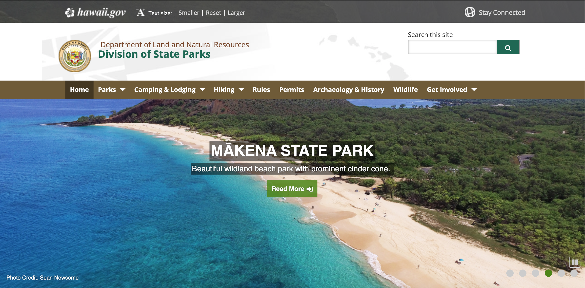

# HI, Hawaii! - a state parks finder for residents and visitors of Hawaii

Vivian Wong, Digital Humanities 110

Assignment 08: Pitch

## Introduction:

This project was inspired by the beautiful state parks and beaches that Hawaii is known for. I took large inspiration from Hawaii's Department of Land and Natural Resources website (which I conducted a heuristic evaluation and competitor analysis for). After seeing the website, I wanted to create a state parks finder that would consolidate all of the information regarding Hawaii's state parks, guides, and recreational activities since users have to search through multiple sites in order to find all of the information needed for their trips. The project's purpose is to serve as a platform for residents and visitors of Hawaii to find and explore the beautiful scenery and activities that the islands have to offer.

## Design Statement: 
Currently, people rely on a variety of websites in order to find information when planning their trips. Additionally, when I was conducting usability testing on Hawaii's Department of Land and Natural Resources website, there were various points of confusion my participant had when interacting with the site, which I wanted to address in my project. I wanted to consolidate as much information and features within my project so that it could be the ultimate resource for planning trips to Hawaii's state parks.

## Competitor Analysis:
I had initially intended for my project to focus on tourism, so for my competitor analysis, I decided to look at two websites. One website was by Hawaii's Department of Land and Natural Resources -- Division of State Parks, which focuses on providing users with information regarding recreational activities and state parks. The second website was by Hawaii's Department of Business, Economic Development and Tourism, which provides users with information regarding locally owned businesses and marketplaces in Hawaii. 

I conducted heuristic evaluations for both of these websites because they are both related to tourism, but I eventually shifted the focus of my project towards Hawaii's state parks and creating improvements upon what the Department of Land and Natural Resources already has. I wanted to redesign this website and create a project that was more interactive and personalized for users for when they plan their trips. An image of the Department of Land and Natural Resources website can be found below. 

[Additional information regarding the heuristic evaluations and competitor analysis can be found here...](https://github.com/vivianwong19/DH110-2021F/tree/main/assignment01)

## Usability Testing
After the heuristic evaluations and competitor analysis, I conducted a pilot usability testing session of the Department of Land and Natural Resources website to see how a new user would naturally interact with the website. The purpose of usability testing is to analyze the three main metrics of usability when it comes to UX/UI: effectiveness, efficiency, and satisfaction. I conducted the test in an in-person environment, and the participant was someone who had never been to Hawaii before. Through this interview, I was able to get a better sense of how someone would interact with the website if they were planning a trip to a location they had never visited before. The usability testing session allowed me to observe the participant and identify areas of improvement within the site.

For the usability testing session, I created a survey for the participant to fill while they were doing the tasks. I designed three main tasks for my participant to do:
1. Finding a specific state park in Hawaii based on the information provided
2. Finding information about a campsite and nearby activities at a state park
3. Finding information about Hawaii's native wildlife

[More information about the usability testing session can be found here...](https://github.com/vivianwong19/DH110-2021F/tree/main/assignment02)

## User research [contextual inquiry, assignment04]:
After conducting the pilot usability test of the Department of Land and Natural Resources website, I conducted a contextual inquiry interview. The contextual inquiry interview comprised of a combination of interviewing and participatory observation. I was able to interview a new participant who enjoys outdoorsy activities, such as hiking. This participant has also been to Hawaii before, so I was able to get insight from someone who was familiar with the location. The contextual inquiry included a question & answer section, as well as two activities. The first activity was to go onto the internet to research and identify a state park in Hawaii they would be interested in visiting. During this task freely chose to interact with the Department of Land and Natural Resources without any guidance from me, which differed in comparison to the usability testing session. The second activity was to create an itinerary for the state park my participant identified, which helped me see how a user would choose find and choose activities at a specific location. Some of the biggest takeaways from the contextual inquiry interview which further helped inspire the design for my project included:
1. Recommendations and first-person accounts are important when it comes to finding a new location
2. Extensive research and planning are preferred over spontaneous trips
3. Convenience is a major factor when it comes to planning activities
4. Activity preferences can change based on location

[Read more about the contextual inquiry here...](https://github.com/vivianwong19/DH110-2021F/tree/main/assignment03)

## UX storytelling [persona+scenario, assignment05]
Summary and link to your assignment folder

## Wireframe and graphic design element variation [assignment06 + part of 07]

## Low-fidelity prototype (wireflow, assignment06)
Summary and link to the sketches (may contains the multiple versions and evaluation history)

## High-fidelity prototype (functional/interactive prototype, assignment08)
Summary statement and link to or an embedded prototype

## Optional evaluation and revision history 
Including cognitive walkthrough; impression test, accessibility audit, usability testing), per each summary and link to the notes (when you share the video or other detailed evidences, I will notify you when you can make the contents private as soon as your work is graded)

## Pitch video 
(after this portfolio is done, you will record a pitch video and embed the video here)

## Conclusion: what did you learn throughout the process?
