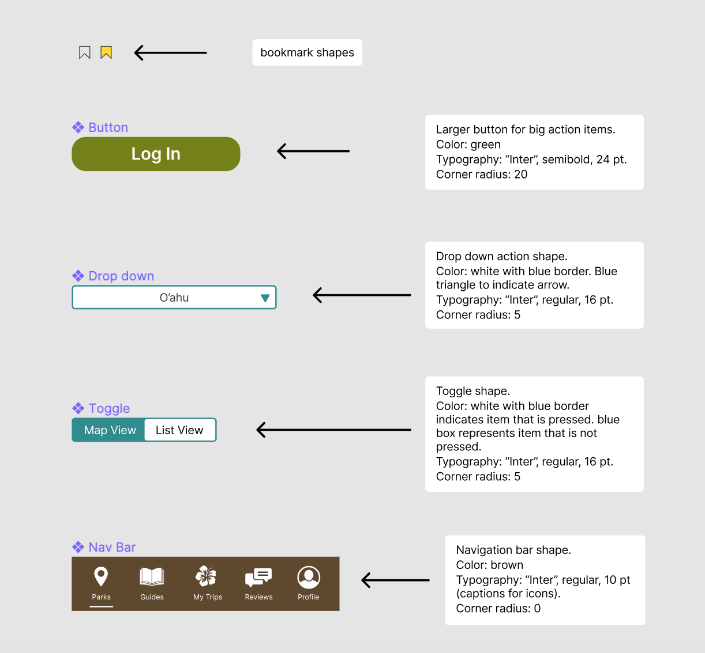

# HI, Hawaii! - a state parks finder for residents and visitors of Hawaii

Vivian Wong, Digital Humanities 110

Assignment 08: Pitch

## Introduction:

This project was inspired by the beautiful state parks and beaches that Hawaii is known for. I took large inspiration from Hawaii's Department of Land and Natural Resources website (which I conducted a heuristic evaluation and competitor analysis for). After seeing the website, I wanted to create a state parks finder that would consolidate all of the information regarding Hawaii's state parks, guides, and recreational activities since users have to search through multiple sites in order to find all of the information needed for their trips. The project's purpose is to serve as a platform for residents and visitors of Hawaii to find and explore the beautiful scenery and activities that the islands have to offer.

## Design Statement: 
Currently, people rely on a variety of websites in order to find information when planning their trips. Additionally, when I was conducting usability testing on Hawaii's Department of Land and Natural Resources website, there were various points of confusion my participant had when interacting with the site, which I wanted to address in my project. I wanted to consolidate as much information and features within my project so that it could be the ultimate resource for planning trips to Hawaii's state parks.

## Competitor Analysis:
I had initially intended for my project to focus on tourism, so for my competitor analysis, I decided to look at two websites. One website was by Hawaii's Department of Land and Natural Resources -- Division of State Parks, which focuses on providing users with information regarding recreational activities and state parks. The second website was by Hawaii's Department of Business, Economic Development and Tourism, which provides users with information regarding locally owned businesses and marketplaces in Hawaii. 

I conducted heuristic evaluations for both of these websites because they are both related to tourism, but I eventually shifted the focus of my project towards Hawaii's state parks and creating improvements upon what the Department of Land and Natural Resources already has. I wanted to redesign this website and create a project that was more interactive and personalized for users for when they plan their trips. An image of the Department of Land and Natural Resources website can be found below. 

[Additional information regarding the heuristic evaluations and competitor analysis can be found here...](https://github.com/vivianwong19/DH110-2021F/tree/main/assignment01)

## Usability Testing
After the heuristic evaluations and competitor analysis, I conducted a pilot usability testing session of the Department of Land and Natural Resources website to see how a new user would naturally interact with the website. The purpose of usability testing is to analyze the three main metrics of usability when it comes to UX/UI: effectiveness, efficiency, and satisfaction. I conducted the test in an in-person environment, and the participant was someone who had never been to Hawaii before. Through this interview, I was able to get a better sense of how someone would interact with the website if they were planning a trip to a location they had never visited before. The usability testing session allowed me to observe the participant and identify areas of improvement within the site.

For the usability testing session, I created a survey for the participant to fill while they were doing the tasks. I designed three main tasks for my participant to do:
1. Finding a specific state park in Hawaii based on the information provided
2. Finding information about a campsite and nearby activities at a state park
3. Finding information about Hawaii's native wildlife

[More information about the usability testing session can be found here...](https://github.com/vivianwong19/DH110-2021F/tree/main/assignment02)

## User Research:
After conducting the pilot usability test of the Department of Land and Natural Resources website, I conducted a contextual inquiry interview. The contextual inquiry interview comprised of a combination of interviewing and participatory observation. I was able to interview a new participant who enjoys outdoorsy activities, such as hiking. This participant has also been to Hawaii before, so I was able to get insight from someone who was familiar with the location. 

The contextual inquiry included a question & answer section, as well as two activities. The first activity was to go onto the internet to research and identify a state park in Hawaii they would be interested in visiting. During this task freely chose to interact with the Department of Land and Natural Resources without any guidance from me, which differed in comparison to the usability testing session. The second activity was to create an itinerary for the state park my participant identified, which helped me see how a user would choose find and choose activities at a specific location. Some of the biggest takeaways from the contextual inquiry interview which further helped inspire the design for my project included:
1. Recommendations and first-person accounts are important when it comes to finding a new location
2. Extensive research and planning are preferred over spontaneous trips
3. Convenience is a major factor when it comes to planning activities
4. Activity preferences can change based on location

[Read more about the contextual inquiry here...](https://github.com/vivianwong19/DH110-2021F/tree/main/assignment03)

## UX storytelling
After the user testing phase, I started on the UX story telling phase. The purpose of UX storytelling is to empathize with the user and to see things from their perspective as the designer. Using the data gathered from the usability test and contextual inquiry, I created personas that represent the user for the app, as well as scenarios they may face, as part of the UX storytelling process. 

I created two personas: Jordan Hills and Miley Pham. Jordan represents a user who doesn't live in Hawaii, but he enjoys travelling and wants to visit the state in order to partake in physical recreational activities. Miley represents a user who has grown up in Hawaii her whole life and is now raising a family in Hawaii as well. She enjoys planning small weekend trips to areas local to her island, but doesn't have much time to do so. After creating the two personas, I also created empathy maps and journey maps for each persona. The empathy map represents what the persona says, thinks, does, and feels. The journey map walks through a scenario where the persona interacts with the design of the project, as well as their though process in regards to the interactions. 

|Jordan's Persona|Jordan's Empathy Map|Jordan's Journey Map|
|---|---|---|
||||

|Miley's Persona|Miley's Empathy Map|Miley's Journey Map|
|---|---|---|
||||

The personas helped me figure out which features to prioritize, especially when taking into consideration the feedback I had previously received from the usability testing and contextual inquiry. I was able to use this information in order to start working on the designs and prototype for my project.

[Find more details about the UX storytelling process, personas, empathy maps, and journey maps here...](https://github.com/vivianwong19/DH110-2021F/blob/main/assignment04/JordanJourneyMap.png)

## Low Fidelity Prototype
The low fidelity prototype phase allows for a cost-effective and quick method for testing initial ideas. The purpose of low fidelity prototyping is to begin brainstorming for potential features and interactions within the app. Through quick sketches (like paper prototyping), less time is invested into the initial designing phase of the project. This is beneficial because designs are extremely subject to change in the beginning stages of designing. I created my low fidelity prototype using an iPad and an app called Notability. Below is an example of the low fidelity prototype I created for this project.

The blue arrows indicate the intended flow of the prototype and which buttons would lead to which interactions. The example image shows the intended wireflow for one of the key features I was designing for (identifying and finding information about a state park in Hawaii). With my research and personas, I had identified some key features I wanted to explore, and created some tasks that I had a participant help test. The tasks included:
- Identifying a state park the user wants to visit
- Finding and creating reviews
- Keeping track of previous trips and parks visited

[Read more about the low fidelity prototype here...](https://github.com/vivianwong19/DH110-2021F/tree/main/assignment05)

## Wireframe and Design Variations:
After getting feedback from a participant on the low fidelity prototype, I started creating the designs on Figma. Before creating the high fidelity prototype, I made one wireframe with different design elements and variations. The purpose of the interface design is to create a design system and digitize the low fidelity design into one with a developed style (color palette, shape variation, and typographic variation). This will make it easier for designing multiple frames for the high fidelity mockup. Attached below are images of the different design element variations that I created for my project.

[Read more about the project's interface design and graphic design variations here...](https://github.com/vivianwong19/DH110-2021F/tree/main/assignment06)

| Color Palette |  |
| --- | --- |
| Shape Variation |  |
| Typographic Variation |  |

## High-fidelity prototype (functional/interactive prototype, assignment08)
Summary statement and link to or an embedded prototype

## Optional evaluation and revision history 
Including cognitive walkthrough; impression test, accessibility audit, usability testing), per each summary and link to the notes (when you share the video or other detailed evidences, I will notify you when you can make the contents private as soon as your work is graded)

## Pitch video 
(after this portfolio is done, you will record a pitch video and embed the video here)

## Conclusion: what did you learn throughout the process?
